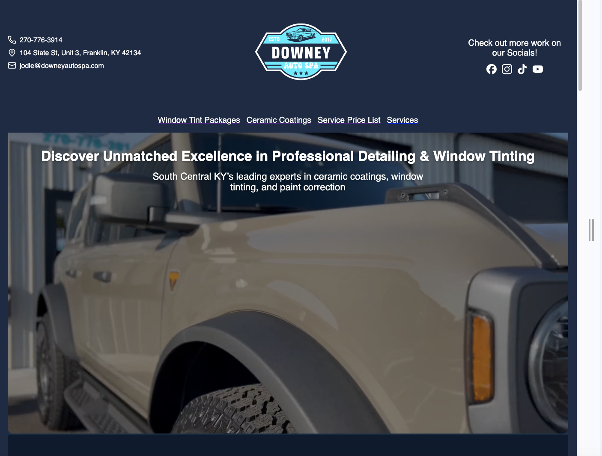
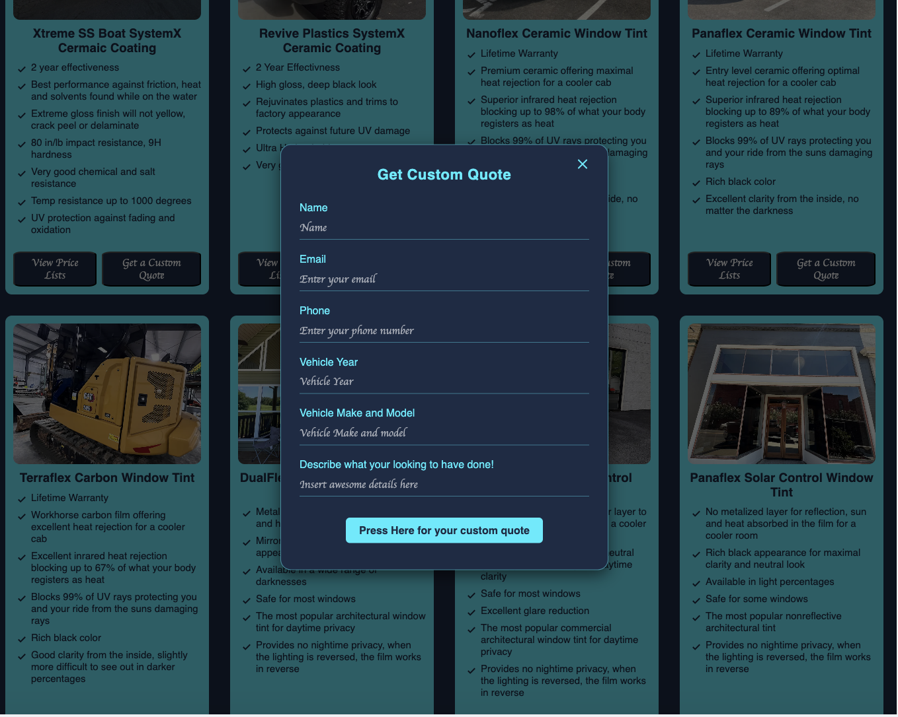
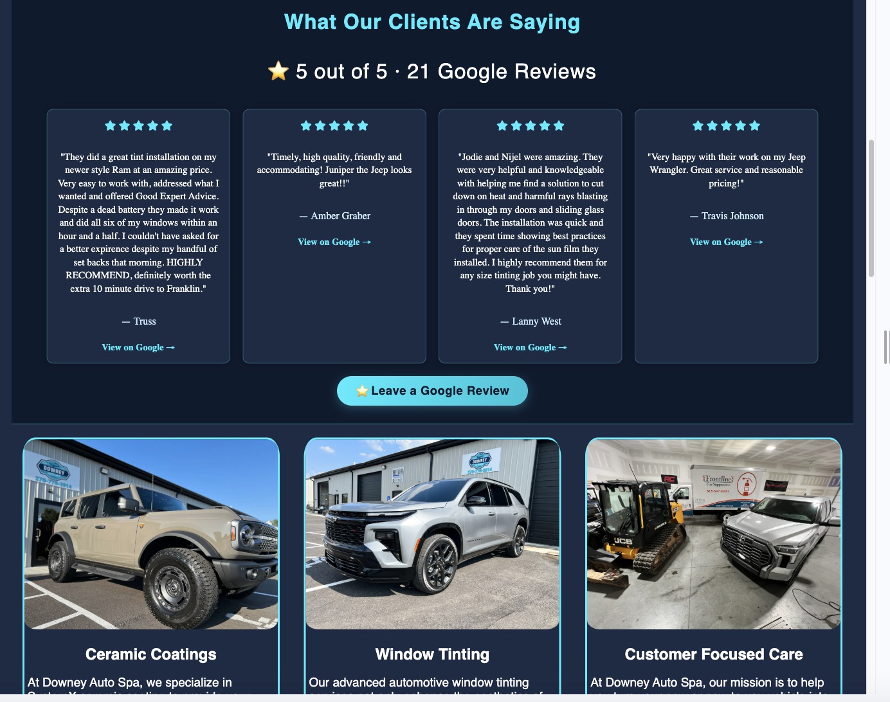

# 🚗 Downey Auto Spa — Full-Stack Business Website

A fully custom, production-grade web application built for Downey Auto Spa, a vehicle detailing and window tinting business in Southern Kentucky.  
This project replaces an outdated third-party provider site with a fast, modern, mobile-first platform designed to streamline customer quotes, display real reviews, and deliver dynamic, weather-informed recommendations.

---

## 🌐 Live Site

**https://www.downeyautospa.com**

---

## 📸 Screenshots

### **Home Page**

### **Weather Based Service Recommendations**

### **Quote Form**

### **Reviews API**

## 🚀 Features

### ⭐ **Customer-Facing**

- Lightning-fast **mobile-first UI**
- Fully responsive hero with optimized MP4 video
- Live **Google Reviews** pulled via Places API
- Weather-based recommendations (OpenWeather API)
- One-click navigation to business location (Google Maps)
- Clean, modern design with custom CSS

### ⭐ **Business-Facing**

- Real-time **quote request submissions**
- Automated branded email notifications powered by **Resend**
- Secure backend with:
  - Input validation (Zod)
  - Rate limiting
  - Custom error handling
  - Hardened CORS configuration
- Full domain/DNS configuration + SSL

---

## 🛠️ Tech Stack

### **Frontend**

- React
- Vite
- Custom CSS (no UI frameworks)
- Hero video optimization (preloading + web-optimized encoding)

### **Backend**

- Node.js
- Express
- MongoDB & Mongoose
- Zod validation
- Nodemailer → Resend migration
- Custom Express error middleware

### **APIs**

- Google Places API (reviews)
- OpenWeather API
- Resend Email API

### **Infrastructure**

- Render (frontend + backend hosting)
- GitHub Actions
- Environment variables
- Domain + DNS (GoDaddy → managed independently)
- SSL & HTTPS enforced

---

## 📬 Quote Request Flow

1. User submits the quote form
2. Input is validated with **Zod**
3. Data saved to MongoDB
4. Business receives an **instant** branded email notification
5. UI displays success message

Robust, simple, and production-ready.

---

## 🔒 Security & Reliability

- Strict CORS whitelist (production + localhost)
- Rate limiting to prevent spam
- Sanitized & validated request bodies
- Error middleware with clean JSON responses
- No client secrets exposed
- HTTPS enforced with valid certificate

---

👩‍💻 About the Developer
Jodie Downey
Full-Stack Developer • Entrepreneur • Co-Owner of Downey Auto Spa
Building scalable, production-ready web applications with clean UI, real-world business logic, and modern tooling.
